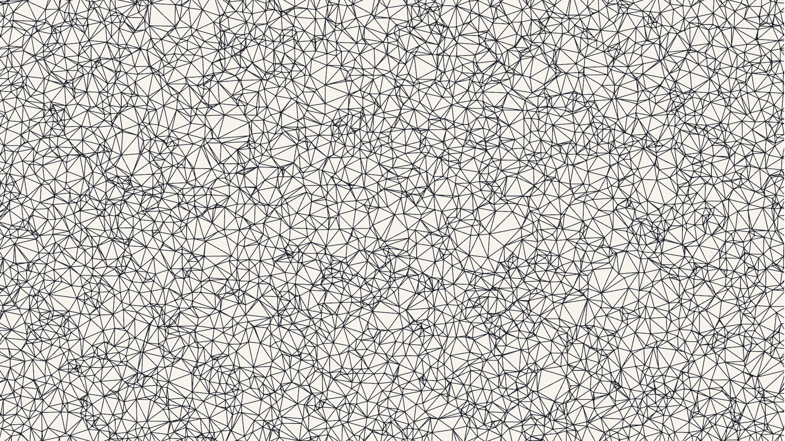

# Delaunay triangulation

Implementation of the Bowyer Watson algorithm for Delaunay triangulation in C++.
Also implement a visualization of the algorithm using raylib.

## Computation time

|Nodes       |  Compute  Time  |
|-----------:|----------------:|
|1,000       |  1        ms    |
|10,000      |  21       ms    |
|100,000     |  263      ms    |
|1,000,000   |  5,126    ms    |
|10,000,000  |  358,716  ms    |

## Visualization

